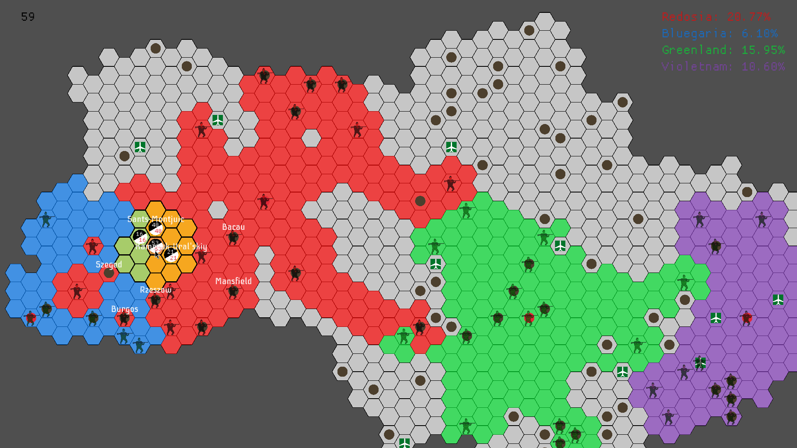

# super-honeycomb-empire

A Rust reimplementation of [this Python project of mine](https://github.com/alicja-januszkiewicz/HE), which itself is a clone of a 2000s flash game by the title of "Hex Empire". Very much a work in progress.

## Controls
- Toggle Game/Editor mode: F1
- Camera Pan: Arrow Keys
- Camera Zoom: Scroll Wheel
- Exit: Escape

### Game Controls

- Select Tile/Issue Command: LMB
- Save Game: F5
- Load Game: F9

### Editor Controls

- Place Tile: LMB
- Toggle Brush Tile Type: RMB
- Toggle Brush Tile Layer: TAB
- Clear Map: C
- Save Map: F5
- Load Map: F9
